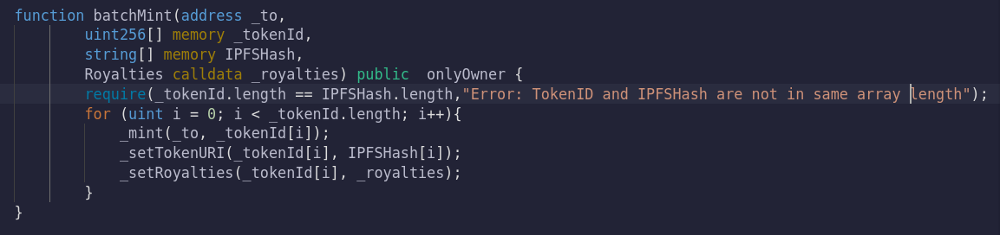
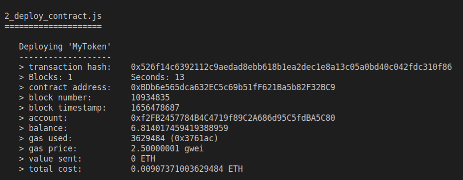
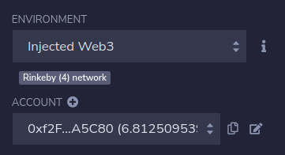
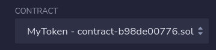
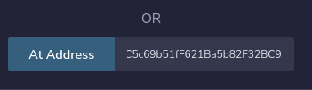
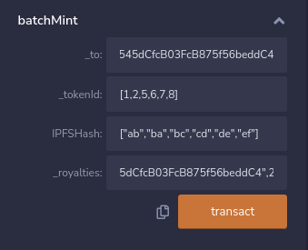
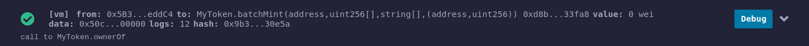
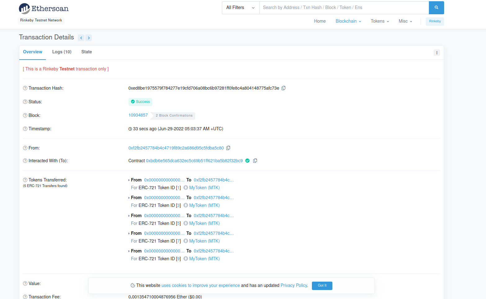
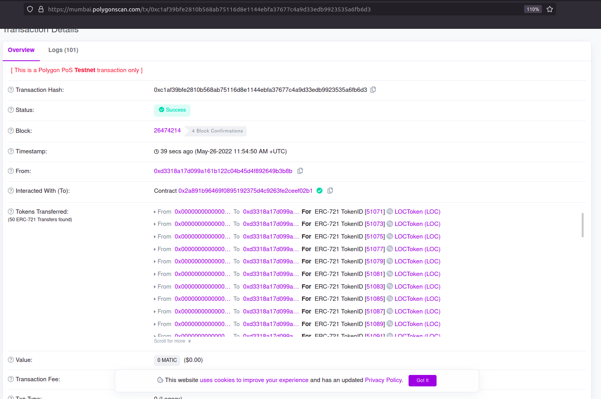

# Batch Mint NFT in ERC721 Contract

- This Project explains how to mint a batch of NFTs in a single transaction in ERC721 Contract .

## Getting started 📖

📁 Create a new folder in VScode 
Open Your termial in Vscode and following commands. or press  `Ctrl+Shift+` `

🏃 Run: -- To Initalize Truffle template and truffle config files.⚙️
```
truffle init
```
🏃 Run: -- To Initalize Node.  ( Here `-y` means we are saying `yes` to all steps in node creation )
```
npm init -y
```


## Node Dependencies 🎒
Try ` npm i ` in cmd to install all nessecary dependencies mentioned in `package.json` file

or use 

``` 
npm install @openzeppelin/contracts 
```
``` 
npm install @truffle/hdwallet-provider
```
## 📌 Core Logic of Batch Minting NFTs In ERC721



## Compiling the Contracts 🛠️

🏃 Run: -- To Compile contracts to create artifacts of contracts

```
truffle compile
```
## Do these steps before deploy 
Go to `truffle-config.js` file and paste your Infura ID or any other RPC provider.

```
    rinkeby: {
    provider: () => new HDWalletProvider(['Your wallet private key'], `Your infura ID / RPC URL`),
    network_id: 4,       // Ropsten's id
    gas: 5500000,        // Ropsten has a lower block limit than mainnet
    },
```


## Deploy the Smart Contract ⛏️

Use the Following Command to deploy the contract

```
truffle migrate --network rinkeby
```
After contract is deployed, copy the contract address from termial


Here is my contract address
```
  > contract address:    0xBDb6e565dca632EC5c69b51fF621Ba5b82F32BC9
```

## Follow these steps after contract is deployed
- Conpy the contract code from `MyToken.sol` file.
- Open REMIX IDE,Go to Deployment tab switch enviroment `Injected Web` In Metamask Swtich your network to Rinkeby.


- Create a new Soildity file and paste the contract code.
- In contract tab drop down select your contract.



- Copy the contract address from termial.
- Paste that address in At address box and click At address button.



- Then you can see your contract will loaded.
- Now go to `batchmint` and pass the values in that parameter.



### Syntax Parameters:
```
_to : "Reciver address"
_tokenId :[pass the tokenIds in array]
_tokenId :[pass the IPFSHash in array string]
_royalities: ["Royalitiy Receiver address / your address",Royality Percentage]
```
### Eg :
```
_to : "0xf2FB2457784B4C4719f89C2A686d95C5fdBA5C80"
_tokenId :[1,3,5,7,9]
_tokenId :["ab","bc","cd","de","ef"]
_royalities: ["0xf2FB2457784B4C4719f89C2A686d95C5fdBA5C80",200]
```
- Then Click Transact it will confrom the transaction.



- Then you can see the Batch of NFTs are minted in single transaction.

## Screeshot of Testing 👀
### In EtherScan [ Rinkeby Network ]


🔗 Link [Click here to see in EtherScan](https://rinkeby.etherscan.io/tx/0xedc492ff1cb369308a5cc3b3cca604332bd9491995758935fe61c50d883fa821)

### In Polygon Mumbai [ Polygon Testnet Network ]


🔗 Link [Click here to see in Polygon Mumbai](https://mumbai.polygonscan.com/tx/0xc1af39bfe2810b568ab75116d8e1144ebfa37677c4a9d33edb9923535a6fb6d3)
